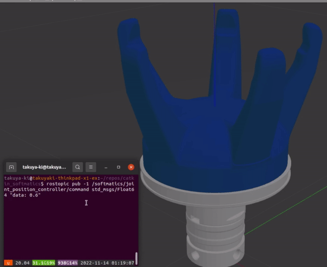
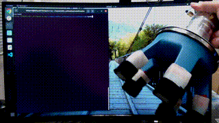

# softmatics

[](http://rosindustrial.org/news/2016/10/7/better-supporting-a-growing-ros-industrial-software-platform)
[](https://opensource.org/licenses/MIT)


ROS package for [NITTA SOFTmatics](https://www.nitta.co.jp/en/product/robothand/) gripper.  
Note that this repository is not an official repository, which is not supported by Nitta Corporation.

## Dependencies


- [Ubuntu 20.04 PC](https://ubuntu.com/certified/laptops?q=&limit=20&vendor=Dell&vendor=Lenovo&vendor=HP&release=20.04+LTS)
  - [ROS Noetic (Python3)](https://wiki.ros.org/noetic/Installation/Ubuntu)

## Installation

```bash
cd catkin_ws/src
git clone git@github.com:takuya-ki/softmatics.git --depth 1
git clone https://github.com/roboticsgroup/roboticsgroup_upatras_gazebo_plugins.git --depth 1
cd ../
sudo rosdep update && sudo rosdep install --from-paths ./src --ignore-packages-from-source --rosdistro noetic -y --os=ubuntu:focal -y
sudo apt install ros-noetic-ros-control ros-noetic-ros-controllers
catkin build -DPYTHON_EXECUTABLE=/usr/bin/python3
```

## Usage

### Display a model
```bash
roslaunch softmatics_description disp_softmatics_model.launch
```

  

### Gazebo simulation
```bash
roslaunch softmatics_gazebo bringup_softmatics_gazebo.launch
rostopic pub -1 /softmatics/joint_position_controller/command std_msgs/Float64 "data: 0.6"
```

  

### Grasp/release execution
1. Upload the sketch.ino to the Arduino board
2. Execute the launch to trigger for grasping/releasing
```bash
roslaunch softmatics_device trigger.launch
```
3. Toggle the current mode (turn on / off)
```bash
rosservice call /softmatics_device/toggle
```
  

## Author / Contributor

[Takuya Kiyokawa](https://takuya-ki.github.io/)

## License

This software is released under the MIT License, see [LICENSE](./LICENSE).
