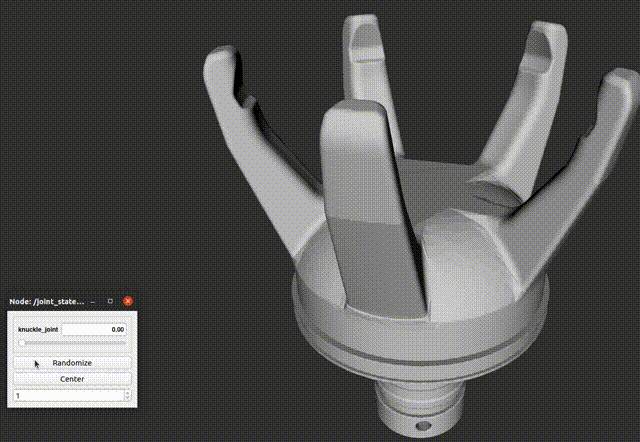

# softmatics

ROS package for [NITTA SOFTmatics](https://www.nitta.co.jp/en/product/robothand/) gripper.

# Dependencies

- ROS Noetic (Python3)

# Installation

    $ cd catkin_ws/src
	$ git clone git@github.com:takuya-ki/softmatics.git --depth 1
    $ cd ../
	$ sudo rosdep update && sudo rosdep install --from-paths ./src --ignore-packages-from-source --rosdistro noetic -y --os=ubuntu:focal -y
	$ catkin build -DPYTHON_EXECUTABLE=/usr/bin/python3

# Usage

## Visualize a model
    $ roslaunch softmatics_description disp_softmatics_model.launch

  

# Author / Contributor

[Takuya Kiyokawa](https://takuya-ki.github.io/)

## License

This software is released under the MIT License, see [LICENSE](./LICENSE).
