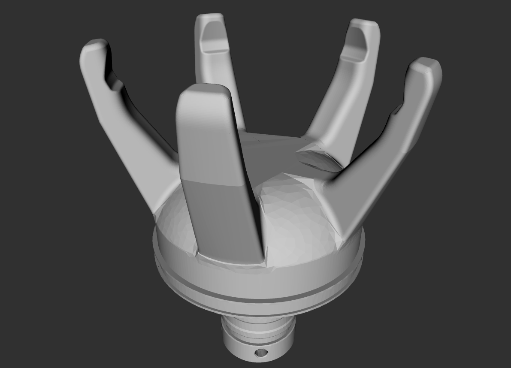

# NITTA SOFTmatics gripper description

This package contains the URDF files describing NITTA SOFTmatics.

To display the gripper URDF description
```
$ roslaunch softmatics_description disp_softmatics_model.launch 
```

## Open
  

## Close
  

## Reference
- To generate a collision model, you can use [rosmodelgen](https://github.com/takuya-ki/rosmodelgen)
