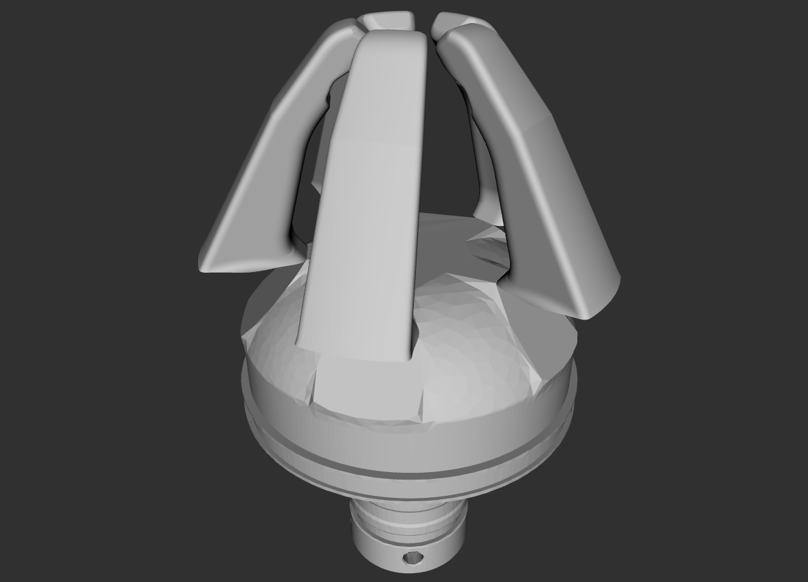

# NITTA SOFTmatics gripper

This package contains the URDF files describing NITTA SOFTmatics.

To display the gripper URDF description
```
$ roslaunch softmatics_visualization disp_softmatics_model.launch 
```

## Open
  

## Close
  
